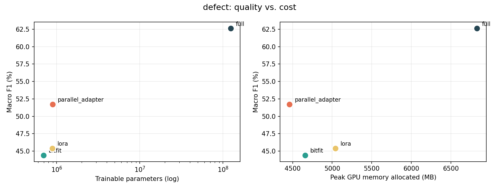

# CodeTuneEfficiency

**What does parameter-efficient fine-tuning actually cost you, and what does it buy you, on code models?**

A reproducible benchmark of four fine-tuning strategies for [CodeBERT](https://huggingface.co/microsoft/codebert-base)
on two CodeXGLUE code-understanding tasks. Every method gets an identical budget, every
number is averaged over three seeds with its spread reported, and — unlike most write-ups
of this comparison — **the cost side of the trade-off is measured, not asserted**.

Everything below was produced on a **free Colab T4** —
[one notebook](notebooks/run_on_free_gpu.ipynb), no paid compute, and the configs in this
repo are the ones that generated it.

**Headline findings** (full discussion in [docs/RESULTS.md](docs/RESULTS.md)):

- **PEFT's storage win is enormous.** A per-task BitFit checkpoint is 2.65 MB against full
  fine-tuning's 475.49 MB — **179× smaller** — and training runs 17–25% faster.
- **The memory saving is real but far smaller than the parameter ratio implies.** Peak
  *allocated* memory fell 26–35% (6,829 MB → 4,460–5,040 MB) as gradients and Adam state for
  125 M parameters went away. But peak *reserved* memory — what the process actually holds
  from the driver — was flat, 7,374 MB against 7,502–7,508 MB. Activations dominate, and
  freezing weights does not shrink activations. A 140× cut in trainable parameters bought a
  ~30% cut in allocated memory and no reduction in footprint here.
- **The method ordering is identical on both tasks** — `full` > `parallel_adapter` >
  `lora` > `bitfit` — and every gap exceeds the seed spread. On clone detection
  `parallel_adapter` is 1.1 accuracy points behind full fine-tuning while training 0.72% of
  the parameters.
- **Accuracy hides the defect-detection gap.** Positive-class F1 is 54.59 for full
  fine-tuning against 17–19 for LoRA and BitFit, which answer "not vulnerable" ~94.5% of the
  time. Read positive F1: 86.4% of clone test pairs are negative, so accuracy alone flatters
  everything.
- **Full fine-tuning on Devign replicates the literature.** 64.33 ± 1.37 here against
  64.92 reported by Liu, Sha & Peng (ASE 2023) for the same model and task.

<!-- RESULTS:START -->

## Results

### clone — 20,000 train / 1,000 test, 2 epochs

| Method | Seeds | Accuracy | Macro F1 | Positive F1 | Trainable | Delta ckpt | VRAM (reserved) | Train time |
|---|---|---|---|---|---|---|---|---|
| `full` | 3 | 93.37 ± 0.91 | 86.77 ± 1.76 | 77.42 ± 2.99 | 100.000% (124,647,170) | 475.49 MB | 7,374 MB | 11.2 min |
| `bitfit` | 3 | 89.20 ± 0.62 | 80.25 ± 0.61 | 66.95 ± 0.85 | 0.560% (694,274) | 2.65 MB | 7,502 MB | 8.8 min |
| `lora` | 3 | 91.73 ± 0.81 | 84.06 ± 1.39 | 73.00 ± 2.31 | 0.710% (887,042) | 3.38 MB | 7,508 MB | 9.3 min |
| `parallel_adapter` | 3 | 92.27 ± 0.64 | 84.96 ± 1.39 | 74.48 ± 2.42 | 0.720% (896,450) | 3.42 MB | 7,508 MB | 8.5 min |

### defect — 21,854 train / 1,000 test, 2 epochs

| Method | Seeds | Accuracy | Macro F1 | Positive F1 | Trainable | Delta ckpt | VRAM (reserved) | Train time |
|---|---|---|---|---|---|---|---|---|
| `full` | 3 | 64.33 ± 1.37 | 62.61 ± 1.64 | 54.59 ± 2.50 | 100.000% (124,647,170) | 475.49 MB | 7,374 MB | 12.1 min |
| `bitfit` | 3 | 57.67 ± 0.67 | 44.42 ± 1.39 | 17.29 ± 2.49 | 0.560% (694,274) | 2.65 MB | 7,502 MB | 9.4 min |
| `lora` | 3 | 58.27 ± 0.42 | 45.41 ± 0.21 | 18.91 ± 0.13 | 0.710% (887,042) | 3.38 MB | 7,508 MB | 10.0 min |
| `parallel_adapter` | 3 | 59.00 ± 0.70 | 51.74 ± 2.97 | 33.11 ± 6.46 | 0.720% (896,450) | 3.42 MB | 7,508 MB | 9.1 min |

<!-- RESULTS:END -->



---

## The four methods

| Method | What trains | Idea |
|---|---|---|
| `full` | everything (100%) | the baseline |
| `bitfit` | bias vectors + classifier | [Ben Zaken et al., ACL 2022](https://aclanthology.org/2022.acl-short.1/) |
| `lora` | rank-8 updates on attention query/value | [Hu et al., ICLR 2022](https://arxiv.org/abs/2106.09685) |
| `parallel_adapter` | a bottleneck MLP alongside each FFN block | [He et al., ICLR 2022](https://arxiv.org/abs/2110.04366) |

`bitfit` and `parallel_adapter` are implemented directly in [`codetune/methods.py`](codetune/methods.py);
`lora` uses Hugging Face `peft`. The parallel adapter's up-projection is zero-initialised,
so it is exactly the identity at step 0 and the pre-trained function is preserved — a
property [asserted in the tests](tests/test_methods.py).

## What is measured

Four cost numbers accompany every accuracy number:

- **trainable parameters** — what the optimizer updates
- **peak GPU memory** — both allocated (what tensors need) and reserved (what the process
  holds from the driver); the two tell different stories and both are recorded
- **wall-clock training time** — what a run costs
- **delta checkpoint size** — bytes you must store and ship *per task*, counting only the
  trainable tensors

That last one is the honest form of PEFT's storage claim. Saving a full model per method,
which is the default behaviour of most training scripts, throws the saving away entirely.

Reported quality metrics are accuracy, macro precision/recall/F1, and positive-class F1.
Positive-class F1 carries most of the signal here: 86.4% of BigCloneBench test pairs are
negative, so accuracy alone flatters every method. The pair also identifies a degenerate run
at a glance — a classifier predicting one class for every input scores exactly 0.50 macro
recall and 0.00 positive F1. Runs whose majority-class rate reaches 99% are flagged rather
than quietly averaged in. None of the runs reported here triggered that flag.

## Quickstart

```bash
git clone https://github.com/Ssavan99/CodeTuneEfficiency.git && cd CodeTuneEfficiency
python -m venv .venv && .venv/Scripts/activate   # Linux/macOS: source .venv/bin/activate
pip install -r requirements-dev.txt
```

```bash
python -m codetune prepare
```

Both datasets come from the public CodeXGLUE copies on the Hugging Face Hub. No account or
token is needed.

```bash
python -m codetune run --config configs/smoke.yaml
```

The smoke config is a CPU-only sanity check that finishes in a couple of minutes. Its
numbers are meaningless at that size — it exists to prove the pipeline works before you
spend GPU time.

Then the real thing:

```bash
python -m codetune grid --config configs/defect.yaml
```

```bash
python -m codetune grid --config configs/clone.yaml
```

```bash
python -m codetune aggregate && python -m codetune plot
```

`grid` skips any run that already has a result file, so an interrupted session resumes
where it left off rather than starting over.

### Tests

```bash
pytest
```

The unit tests build a tiny randomly-initialised RoBERTa in-process, so they run offline
in seconds and never download a checkpoint. The end-to-end test skips cleanly if the
datasets or the base model are unavailable.

## Experimental design

| | |
|---|---|
| Base model | `microsoft/codebert-base` (125 M) |
| Tasks | Devign defect detection (C) · BigCloneBench clone detection (Java) |
| Budget | identical for every method — same epochs, data, sequence length, seed |
| Seeds | 42, 1337, 2024 · mean ± std reported |
| Learning rate | 5e-5 full, 1e-4 PEFT |
| Precision | fp16 (Turing — no bf16) |
| Early stopping | off, deliberately |

**Equal budgets are the point.** Comparing methods that received different epoch counts
measures the schedule, not the method. Early stopping is disabled for the same reason: it
silently hands more optimisation to whichever method happens to keep improving.

**Scale is stated, not hidden.** Devign runs on its full 21,854-example training set.
BigCloneBench is subsampled to 20,000 of 901,028 pairs, and both test splits to 1,000, so
all 24 runs fit inside one free Colab session. Every size is recorded in every result JSON,
and the configs that produced the published tables are the ones in this repo.

**Hardware.** The tables come from a free Colab T4 (16 GB). The test suite and the CPU smoke
config run anywhere; the full grid does not fit in 6 GB at these settings — see the note at
the top of `configs/defect.yaml` for smaller-card values.

## Layout

```
codetune/       the benchmark: data, methods, cost accounting, training, reporting
configs/        smoke (CPU) · defect · clone
tests/          offline unit tests + an end-to-end smoke test
notebooks/      free-GPU runner for Colab / Kaggle
results/        per-run JSONs, summary.csv, summary.md, figures/
docs/           results discussion
clone/ defect/ petl/     vendored reference code, MIT (see THIRD_PARTY.md)
```

## Reading the results

Full discussion — imbalanced-baseline caveats, the two-sided memory story, and comparison
against published numbers for the same model and tasks — is in
[docs/RESULTS.md](docs/RESULTS.md).

## Attribution

The experimental design follows Liu, Sha & Peng, *An Empirical Study of Parameter-Efficient
Fine-Tuning Methods for Pre-Trained Code Models* (ASE 2023), whose study of PEFT methods on
code models this benchmark takes as its starting point.

`clone/`, `defect/` and `petl/` vendor code from that paper's artifact release, unmodified
and MIT licensed — see [THIRD_PARTY.md](THIRD_PARTY.md). It is kept for reference; nothing
in `codetune/` imports it.

The method implementations, cost instrumentation, experiment harness and results in this
repository are original work.

## Licence

MIT — see [LICENSE](LICENSE). Upstream code retains its own MIT terms; attribution is in
[THIRD_PARTY.md](THIRD_PARTY.md).
